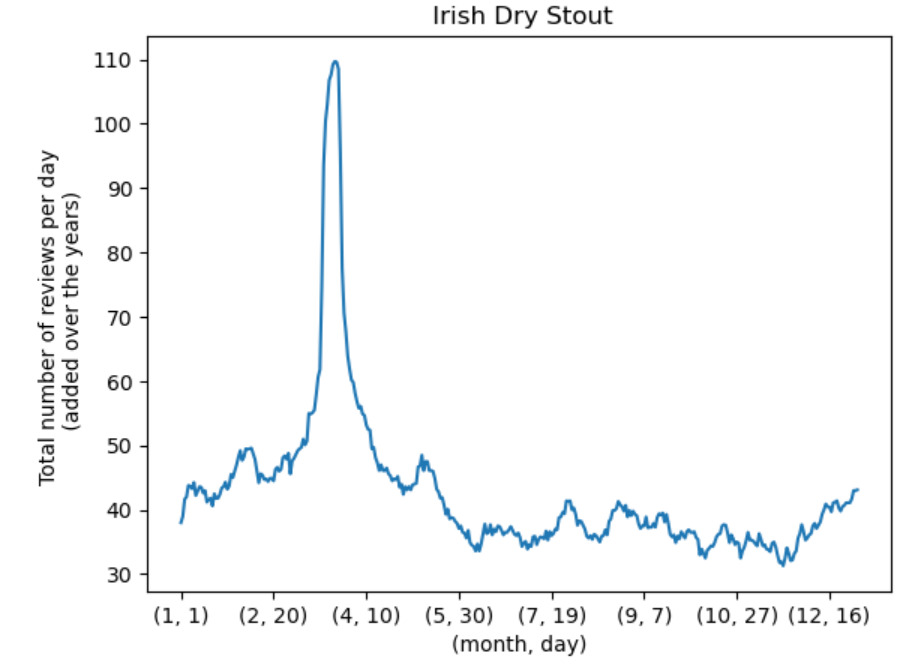
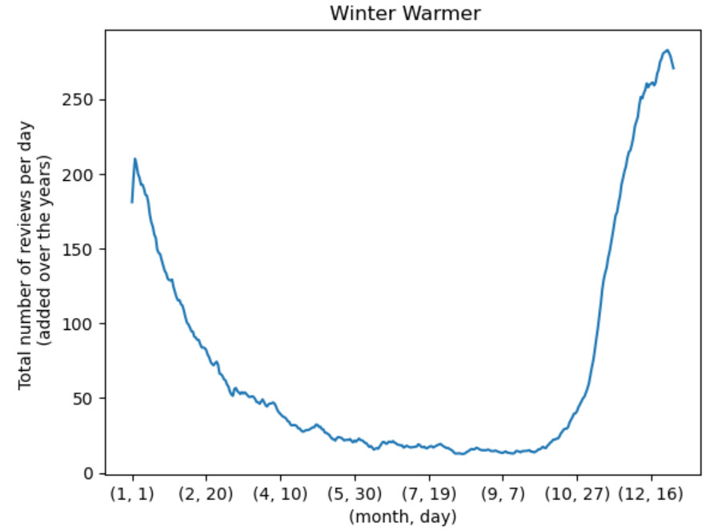
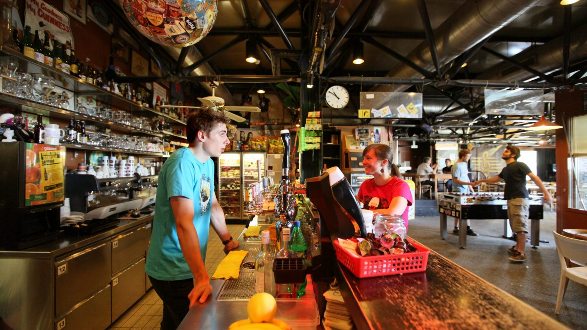
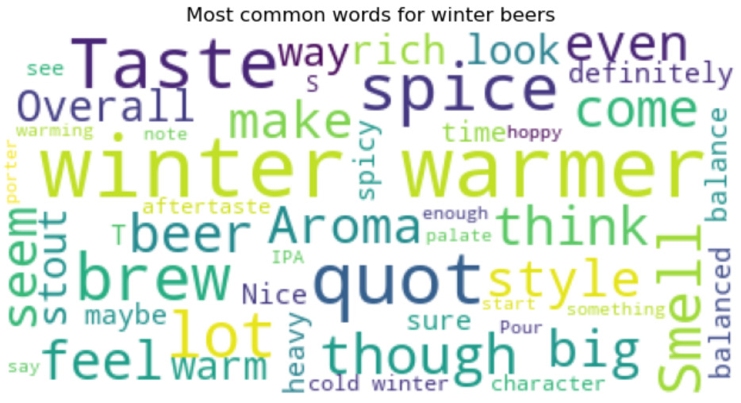
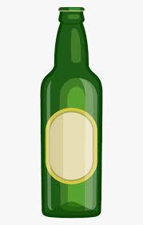

As a small brewery, it's important to stay up to date on the latest trends in the beer industry. One way to do this is by analyzing reviews from websites like BeerAdvocate and RateBeers, where beer enthusiasts share their thoughts on different types of beers. Our brewery is curious to know what makes a beer trendy at a certain period of the year and if it will be trendy the following years. In particular, we are interested in finding out which types of beers would be best suited for a winter beer release and more specifically for a Christmas beer release. We would also like to understand what goes into making such a beer: what are the most desired features and typical charateristics of a winter beer? Finally, the brewery seeks to discover how much this new perfect Christmas beer will be consumed relatively to other beers.

# Beer seasonality
The first step to grasping what makes a good christmas beer is to actually find some good christmas beers. As a starting hypothesis, we assumed that the temporal density of reviews of a beer was a good proxy for it's popularity. Based on this, beers were grouped by their type (IPA, Stout, Belgian ...) and the reviews of each day were counted. From this, we optained some beers with particular trends:

We can typically see how certain events influence a beeer's popularity (St. Patrick's day for the irish stout and Christmas / New Year's Eve for the Winter Warmer) :

 
 

> Maybe also a steady beer e.g. IPA
> Talk about why this can tell us which beers have seasonnality

In order to really select the beer that were the most seasonnal, we gave the seasonality a rating. By decomposing the review count per day, we could isolate the trend of the beer, it's seasonnality score and how much our model was off. With this some special types of beer and some particular beers could be isolated.

> Insert graph of decomposition (Hugo graph)
> Describe what we can see, why it's interesting, maybe put also a non seasonal beer

> Insert interactive scatter plot with seasonality
> Allow to interact with it, maybe give a description of the beers when clicked on

# Review sentiment analysis
Using Natural language processing(NLP) methods, positive reviews could be selected. By subselecting the beers with a high average rating, We could extract the reviews that were considered positive and the ones that were considered negative. Here are some of the most prevalent words in each exculding some generally occuring words such as "beer" or "the"

> insert word cloud with positive vs negative words
> Talk a bit about the words that came out and what it intuitively has to do with positive/negative beers

By using the Winter beers selected by the seasonality analysis, we get these most occuring words

> insert word cloud with positive vs negative words for winter beers
> Talk a bit about the words that came out and what it intuitively has to do with winter beers, maybe compare with the same set of graphs for summer beers

# Feature extraction
Now that we know which beers are popular in winter and that we know which of these beers have recieved a good review, we can extract features from these reviews. This implies finding the positive and negative adjectives attached to each feature that we are trying to study. These features can be properties of the beer such as flavour notes or color. They can also be any other nouns that relate to the beer such as the bottle and the pour.

> Insert radio graph with the most occuring relations of certain features, maybe select feature from list and have it show up
> Talk about interesting features and most occuring ones

# Conclusion
In light of all the previous findings, ....

### Little reminder : if you want to taste a beer :

 

  

# RENDU 2

## Proposed method of analysis
### Preprocessing

The data are already quite clean for this dataset: a large portion of data wrangling was already done for us. Also, we do not consider the _./ratings.txt.gz_ files in the BeerAdvocate and RateBeer folders, as they are an unclean version of the _./reviews.txt.gz_ files. 
Firstly, some beers do not provide enough data to be taken into account in our processing. Thus, we filter for beers that have been reviewed for more than two years, and which already have enough feedbacks. The threshold for that is decided based on the distribution of the number of reviews per beer.

To ease the access and the opening speed, we store those data as a pickle file (_.pkl_).

### Feature extraction

Then, by analysing review density of different beers types (e.g. IPA, American Pale Wheat Ale) as a proxy for beer popularity, we select a subset of beers that show a strong seasonnal trend as shown [here](https://towardsdatascience.com/finding-seasonal-trends-in-time-series-data-with-python-ce10c37aa861), in particular for the winter months.

We can typically see how certain events influence a beeer's popularity (St. Patrick's day or Christmas / New Year's Eve for example) :

 
 

To further study those particular beers, we will take a look at the average grades to analyze how appreciated those popular beers are, along with the feeling experienced by the reviewers, and perform a comparison between the metrics of the seasonal beers and the non-seasonal ones.

### Lexical differences between all beers and winter related beers

 

  
   

Based on the lexic used to review winter beers, we would like to extract the key features and words describing what makes a beer a successful one during winter period. Should any Natural Language Processing be required, we will conduct a sentiment analysis on these reviews using the _NLTK_ library. This will provide us with the needed tools to investigate how much the user appreciated it.

## Beer seasonality analysis
To be able to select a subset of seasonal beers, a trend analysis was conducted. To do so...

## Review sentiment analysis and feature extraction
Once the season beers have been selected, it's important to know which ones are good and which are bad. To do so, we check with the beers that have a good rating and test for positive text reviews. From this it's possible to extract the characteristic

## Regroup, answer the question of title

## Conclude

 
## Methods

# Rendu 3
 

  

### Little reminder : if you want to taste a beer :

 

  

### tests





