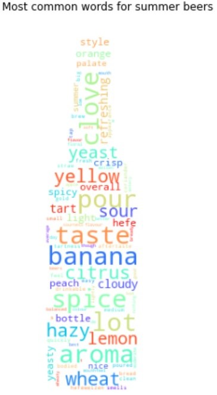

 
As a small brewery, it's important to stay up to date on the latest trends in the beer industry. One way to do this is by analyzing reviews from websites like BeerAdvocate and RateBeers, where beer enthusiasts share their thoughts on different types of beers. Our brewery is curious to know what makes a beer trendy at a certain period of the year and if it will be trendy the following years. In particular, we are interested in finding out which types of beers would be best suited for a winter beer release and more specifically for a Christmas beer release. We would also like to understand what goes into making such a beer: what are the most desired features and typical characteristics of a winter beer?

Our approach can be separated in three parts that we will explore sequentially during this data-story. Firstly, we seek to find seasonal beers by analyzing the temporal density of the reviews. Then we assess which beers are positively reviewed. Moreover we focus on deconstructing the reviews to grasp the key characteristics, such as flavour or color. Finally, we examine what positive attributes each characteristic has, e.g. a nutty attribute for the flavor characteristic. After all these steps, we could find what makes the best data-driven Christmas beer.

# Which beers are seasonal ?
The first step to grasping what makes a good christmas beer is to actually find some christmas beers. As a starting hypothesis, we assumed that the temporal density of reviews of a beer is a good proxy for it's popularity: a beer that is reviewed a lot around Christmas and nearly not during summer is considered to be a Christmas beer. Based on this, beers were grouped by their type (IPA, Stout, Belgian ...) and the reviews of each day were counted. From this, we obtained some beers with particular trends:

We can typically see how certain events influence a beer's popularity (St. Patrick's day for the irish stout and Christmas / New Year's Eve for the Winter Warmer) :

 
 

> Maybe also a steady beer e.g. IPA
> Talk about why this can tell us which beers have seasonality
 
In order to really select the beer that were the most seasonal, we gave the seasonality a rating. By decomposing the review count per day, we could isolate the trend of the beer, it's seasonality score and how much our model was off. Through this analysis, some beer types were found to display strong seasonal trendiness. The *Irish Stout* is a great example. We expect it to be mainly consumed around St. Patrick's day (17 March). 



As we can see from the graph above, the review density peak lies exactly in March each year. By separating the overall popularity (Trend) from a periodic signal (Seasonality), The peaks in popularity are even more visible. Even a beer that had a very successful couple of years will be picked up by this decomposition.

The same decomposition is also valid on individual beers, given that they have enough reviews. Here we look at the *Délirium Noël*. As the name suggests, the expected popularity peak is around Christmas.



Again, we see what was expected: a peak around December. Since this beer is probably only available around Christmas, this result is not surprising. Nonetheless, the cause of the popularity surge doesn't matter. If the beer is available all year or if it is only available at Christmas, it remains a holiday season beer. Therefore the hypothesis of using a beer review density as popularity stands.   

Knowing this, we could do the decomposition for every beer type on the websites RateBeer and BeerAdvocate to find the beers with the highest seasonality. For Christmas, we looked at the beers that had a high seasonality coefficient value in the winter months and we obtained the following beers: 

 

The beers found correspond to our expectations with most having a reference to Christmas or to Winter in their titles.
By looking at the beers that have their seasonality peak in summer, we can also find some summer beers:

 

# Of these seasonal beers, which ones are good?
Once the beers that display a trend around december are selected, we want to know which ones are overall appreciated. Relying solely on the rating isn't enough: some people give strict ratings but very positive written reviews and vice-versa. To remedy to this issue, natural language processing (NLP) methods were used. We could then qualify the reviews based on if they were considered positive or negative. By simply counting how much a word appears in the reviews, we can find the most prevalent words to describe categories of beers. First of all, the overall most used words to describe beers were found. To be able to capture the most common words for the winter beers, the most common words overall were removed.

 
 
 

On the image on the left, we can find the most common words used to describe the beers of the dataset. Not surprisingly, some words like *"beer"* or *"flavour"* appear very often in the reviews. Therefore, once removed, we should obtain a good idea of the winter beer words in the middle and the summer beer words on the right. In the winter beers, we find a lot of words that describe the beer characteristics and aren't very useful, such as *"taste"* or *"aroma"*. Nonetheless, we get some interesting attributes that appear like *"spice"*, *"Fruits"* or *"Cinnamon"*. The same idea can be done for the summer beers. Some interesting words are *"banana"*, *"citrus"* or again *"spice"*.

# What makes a good winter beer?
Now that we know which beers are popular in winter and that we know which of these beers have received a good review, we can extract features from these reviews. These features can be properties of the beer such as flavour notes, color or even the bottle itself. This consists of finding the adjectives attached to each feature that we are trying to study. Since we are studying a subset of the reviews of positive reviews trendy in december, the adjectives attaches are expected to describe a positive trait of the beer. We choose to take the 5 features that appear the most often. Then for each feature, we extract again the 5 most recurrent words that describe this features. By normalizing these values to get a percentage of occurrence, the most important characteristics and their most important attributes can be plotted:

For winter time, we get:


We also wanted to know if a characteristics of a good winter beer are also required to make a good summer beer. To do so, the same analysis done to winter beers was also done for summer beers giving:


# How can we make the perfect Christmas beer?
With this, we can start to answer the initial question: How do we make this perfect christmas beer? Intuitively, it is possible to choose some Christmassy attributes. One would assume a cinnamon flavoured beer would suit a Christmas beer. By looking at the word clouds, these intuitions can be confirmed or not. But giving Christmassy tastes to the beer won't always make it popular. To know what the most popular beer attributes are, we need to look at the radar plots. We see that some of the attributes are shared between winter and summer beers, but we can nonetheless define a good christmas beer:  

  

    <h5>The best winter beer  </h5>
    
Head: White 

    
Color: Brown 

    
Carbonation: Medium 

    
Lacing: Nice/Good 

    
Body: Medium 

  

  

    
 
      

        

        

        

        

        

        

        

        

        

        

        

        

      

    

  

The same applies for a good summer beer:

  

    <h5>The best winter beer  </h5>
    
Head: White 

    
Color: Golden/Yellow 

    
Carbonation: High 

    
Lacing: Nice/Good 

    
Body: Medium 

  

  

    
 
      

        

        

        

        

        

        

        

        

        

        

        

        

      

    

  

# Conclusion
In light of all the previous findings, beers have a seasonality and they have typical characteristics depending on the season. Certain beers have common features such as the body, the head or the carbonation of the beer. But value features will differ depending on the season. But our first question was to understand what makes a typical christmas beer. Obviously, christmas beers are beers that are consumed during the winter season with typical characteristics such as white foam, dark colors, and not too much carbonation. We can see that there are quite some differences with sumer beers which have characteristics like golden colors, high level of carbonation. 

# Hoppy Christmas and a happy brew year!

  <h3>Little reminder : if you want to taste a beer :</h3>

  

    
  

